# TeslaMate Custom Grafana Dashboards

### Last release: [v2025.3.11](https://github.com/jheredianet/Teslamate-CustomGrafanaDashboards/releases/)

<!-- PROJECT SHIELDS -->
<!--
*** I'm using markdown "reference style" links for readability.
*** Reference links are enclosed in brackets [ ] instead of parentheses ( ).
*** See the bottom of this document for the declaration of the reference variables
*** for contributors-url, forks-url, etc. This is an optional, concise syntax you may use.
*** https://www.markdownguide.org/basic-syntax/#reference-style-links
-->
[![Stargazers][stars-shield]][stars-url][![Contributors][contributors-shield]][contributors-url][![Forks][forks-shield]][forks-url][![Issues][issues-shield]][issues-url][![Discussions][discussions-shield]][discussions-url][![MIT License][license-shield]][license-url]

This is a project with **Custom Grafana Dashboards**, created especially to work with a **Teslamate installation**. So the main requirement for these dashboards to work, is to have a **[Teslamate](https://docs.teslamate.org/)** running instance.

## TeslaMate

**[Teslamate](https://docs.teslamate.org/)** is a powerful, self-hosted data logger for your Tesla.

- Written in **[Elixir](https://elixir-lang.org/)**
- Data is stored in a **Postgres** database
- Visualization and data analysis with **Grafana**
- Vehicle data is published to a local **MQTT** Broker

___

## How to Auto-import these Custom Dashboards

In order to auto-import all the dashboard files from this repository, considering that your are using the official  [Teslamate Docker install](https://docs.teslamate.org/docs/installation/docker) documentation guide, proceed as follows.

**Note:** If you are using Teslamate without Docker you may skip these section and proceed to import manually.

- The following command will clone the source files from this repository. This should be run in an appropriate directory within which you would like to keep it. You should also record this path and provide it later in the following steps. To keep it easy, you may run this your home path (~/) or modify it accordingly.

```bash
git clone https://github.com/jheredianet/Teslamate-CustomGrafanaDashboards.git
```

- Edit your Teslamate "docker-compose.yml" file and add these two new lines at the end of the "volumes" section of the grafana container

```yaml
services:
  ...
  ...
  grafana:
    ...
    ...
    volumes:
      - teslamate-grafana-data:/var/lib/grafana
      - ~/Teslamate-CustomGrafanaDashboards/customdashboards.yml:/etc/grafana/provisioning/dashboards/customdashboards.yml
      - ~/Teslamate-CustomGrafanaDashboards/dashboards:/TeslamateCustomDashboards
```

- Save your file and then **recreate** Grafana container (docker-compose up -d)
- Browse the Grafana Dashboards from the Web and you should have a new "TeslaMate Custom Dashboards" folder

## Using other path for repository

Attention! On some VPS from certain providers like Google GCC, the user running docker engine is not the current user so it's home folder is different, or maybe you just want to use a specific folder for your data. If this is the case, it's better to use the **full path** of the repository where you cloned it, instead of using the home path of the current user (~/). So, be sure to modify the path of the volumes section accordingly, as the sample given below:

```yaml
services:
  ...
  ...
  grafana:
    ...
    ...
    volumes:
      - teslamate-grafana-data:/var/lib/grafana
      - /some/path/Teslamate-CustomGrafanaDashboards/customdashboards.yml:/etc/grafana/provisioning/dashboards/customdashboards.yml
      - /some/path/Teslamate-CustomGrafanaDashboards/dashboards:/TeslamateCustomDashboards
```

## How to update the Dashboards

If you want to be sure that you are using the latest version of the Dashboards:

- Pull again from the repository

```bash
git -C ~/Teslamate-CustomGrafanaDashboards pull
```

- Then **restart** Grafana container

```bash
docker compose restart grafana  
```

Or (if you are using a previous docker version)

```bash
docker-compose restart grafana  
```

## How to use these Custom Dashboards

In order to use these dashboards, once imported, you may want to go to the Grafana "Browse" option (from the left vertical bar), from there you will see a new folder with the imported dashboards.

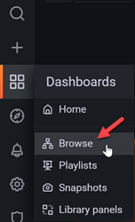 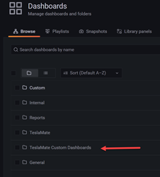

This Custom Dashboards have a special label so they don't get mixed up with the Teslamate defaults dashboards to distinguish easier and group together. When you are in a Custom Dashboard you will see in the upper right corner, a drop-down button from  you may access the rest dashboards as well.

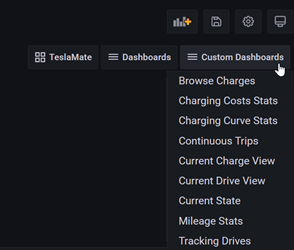
___

## How to manually import these custom dashboards

The following steps let you import the JSON files into your setup if you don't want to auto-import them:

- On Grafana (from Teslamate instance), Browse Dashboards then Import...
- Upload JSON file or import via panel json by pasting the raw content of te JSON file.
- On the next screen you may name the dashboard as you wish or accept the suggested one.
- Try to keep UID as it is, because it could be linked inside the dashboard and to avoid duplicates UIDs.
- Finally, press the "Import" button

## Tips on Dashboards

Have in mind that each dashboard may have an "Information" icon (as shown in the following image). If you point on it, you'll have aditional information on the current panel. Try to check it while you are browsing or analizing your data.

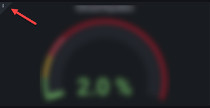
___

## Screenshots

### [Amortization Tracker](./dashboards/AmortizationTracker.json)

This dashboard aims to show the depreciation value of the car over time and its journey.
Depreciating a car by its mileage can be done using various methods. A common approach is to use a depreciation rate per mile or to create a depreciation curve based on data. On the other hand, the depreciation of a car due to age can vary depending on several factors such as the make, model, overall condition of the vehicle, and demand in the market. Here you can put your costs, rates and other variable values to have and idea of the depreciated car value and fuel savings.

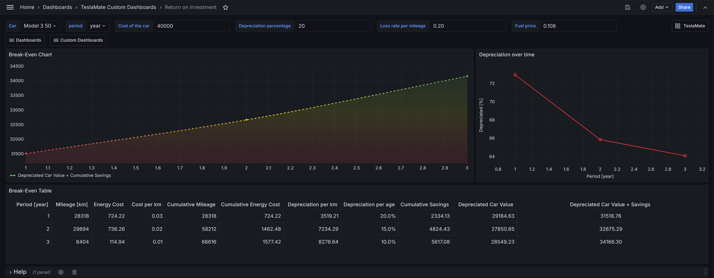

### [Battery Health](./dashboards/BatteryHealth.json)

This dashboard has been already migrated (given) to the core dashboards of Teslamate and will continue developing directly there with the collaboration of all the enthusiasts in the community. You will find it there with the same name **Battery Health**.

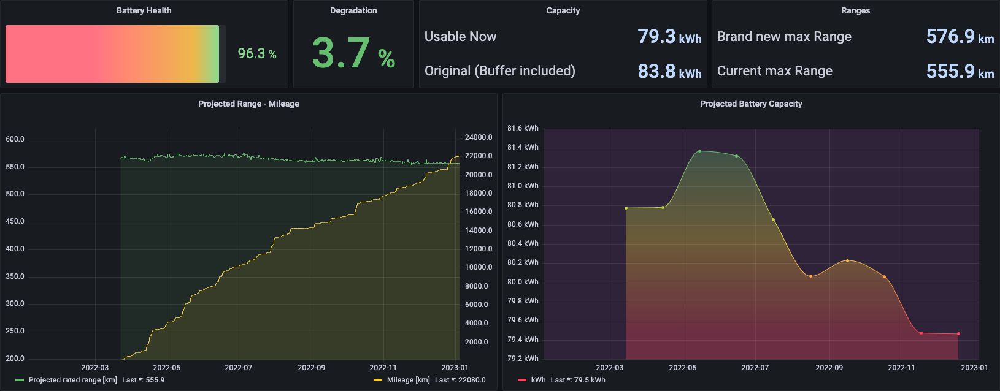

### [Browse Charges](./dashboards/BrowseCharges.json)

This dashboard has been already migrated (given) to the core dashboards of Teslamate and will continue developing directly there with the collaboration of all the enthusiasts in the community. You will find it there with the name **Charges**.

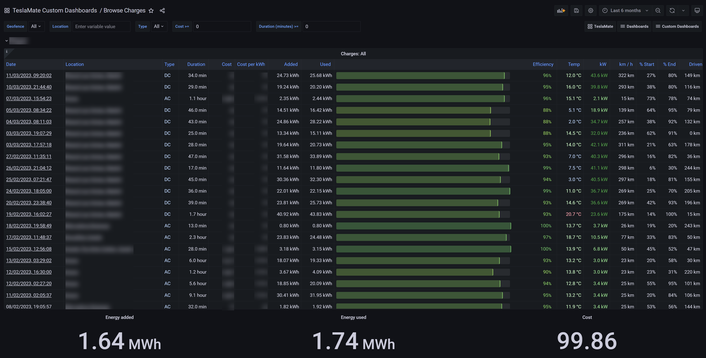

### [Charging Costs Stats](./dashboards/ChargingCostsStats.json)

This dashboard is meant to have a look of all the charges in a given period (last 10 years by default).
You can see the distance driven, number of charges, total charging cost, etc., both in summary or in
separated lists.

You can expand/collapse the rows as needed.

From the Monthly Stats row, you will have a table with links to other Teslamate Dashboards to have a look on a specific period, charge or trip.

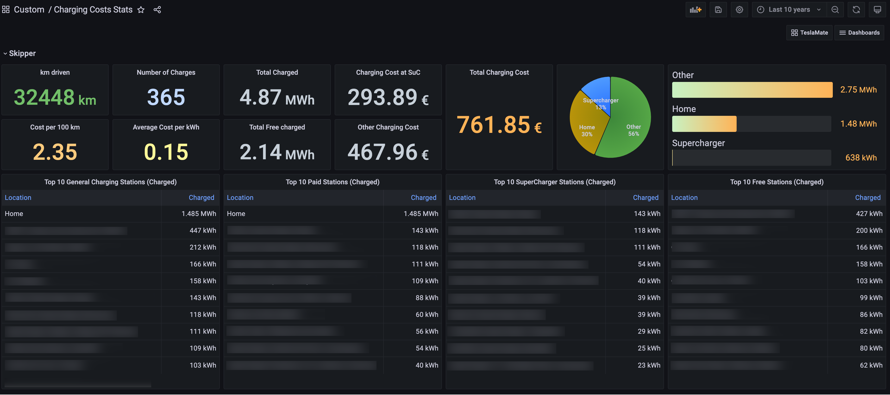

### [Charging Curve Stats](./dashboards/ChargingCurveStats.json)

This dashboard is meant to have a look of the charging curve sessions on Tesla Supercharges or other Fast Charging Station. Also, you can see number of fast charging sessions you've done on each type of chargers and the count of max power (kW) reached on a session as shown in the following example.

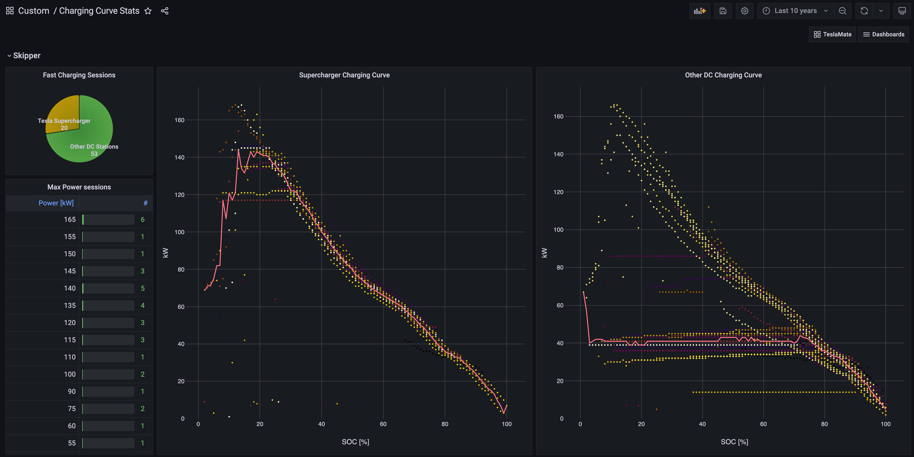

### [Continuous Trips](./dashboards/ContinuousTrips.json)

This dashboard has a table with all the trips you've made between charges sesions, so you can browse the longest or shortest mileage you travel.

You may also take a look to a specific trip from the initial charge session (before the trip) to the end of the of the charge session (after the trip), through the link in the first column that will take you to the TeslaMate Trips dashboard.

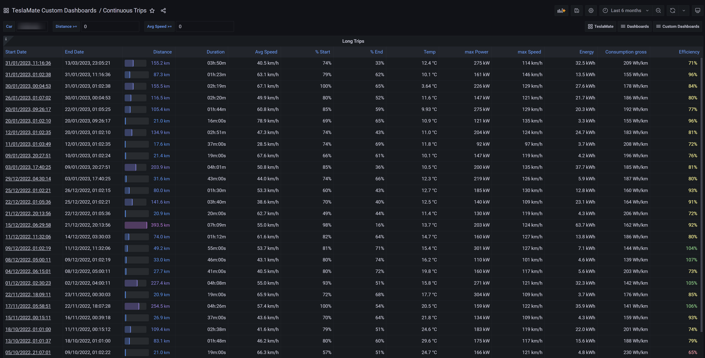

### [Current Charge View](./dashboards/CurrentChargeView.json)

Load this dashboard to while you are in a charging sesion. When you open this dashboard it will show the last 15 minutes, but you should click the "Current Charge" button at the top right corner, to enter in Kiosk mode:

- If you are charging, you will see the information from the start time of the current charge session until now and it will refesh automatically every 30 seconds.
- If you are just browsing (not charging) you will see the information of the last charge session.  

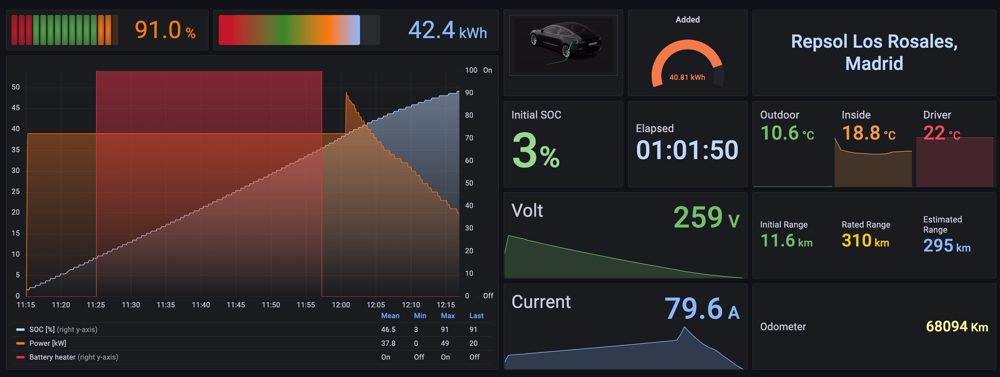

### [Current Drive View](./dashboards/CurrentDriveView.json)

This is a special dashboard to load while driving. When you open this dashboard it will show the last 15 minutes, but you should click the "Current Drive" button at the top right corner, to enter in Kiosk mode:

- If you are driving, you will see the information from the start time of the current drive until now and it will refesh automatically every 30 seconds.
- If you are just browsing (not driving) you will see the information of the last drive.  

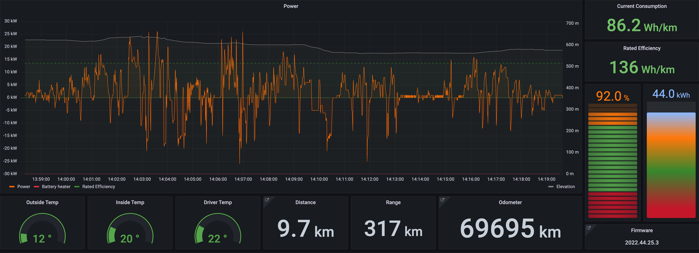

### [Current State](./dashboards/CurrentState.json)

This dasboard is just to see the current state of the car with the last data recorded by TeslaMate.

Additionally, you can see the states stats of the selected period.

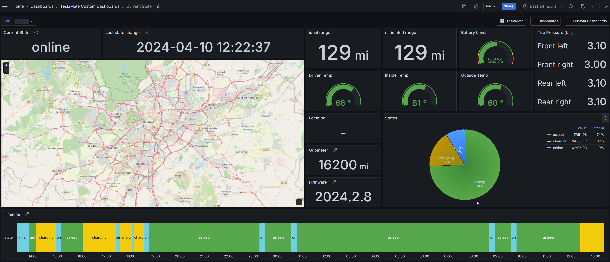

### [Database Information](./dashboards/CurrentState.json)

This dashboard has been already migrated (given) to the core dashboards of Teslamate and will continue developing directly there with the collaboration of all the enthusiasts in the community. You will find it there with the name **Database Information**.

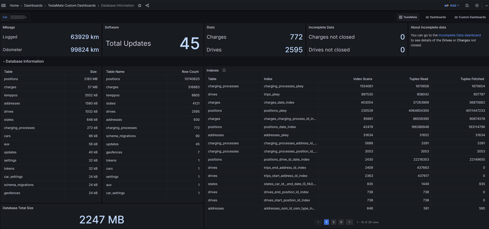

### [DC Charging Curves By Carrier](./dashboards/DC_ChargingCurvesByCarrier.json)

This dasboard is browse your DC charge sessions by charger carriers.

It's important that you have Geo-Fences added related with the name of the carrier
you have recharged your car, or you may want to edit periodically the **name** field of the **addresses** table, so that it contains its name.

For example, if **Teslamate** geolocates the name as *"Esso Purley Way"* you may modify it to *"Esso Purley Way - IONITY"* or *"IONITY Esso Purley Way"*, then you can filter using the filter textbox **IONITY** to show all the charging curves of all charging sessions at that carrier.

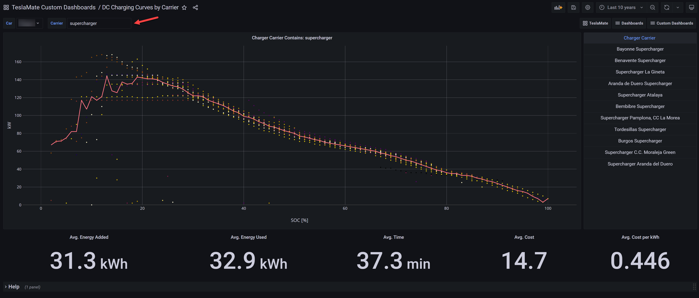

### [Incomplete Data](./dashboards/IncompleteData.json)

With this dashboard you may find your incomplete drives or charges that have been interrupted by the connection or any other issue. So you may follow the official guide to fix it.

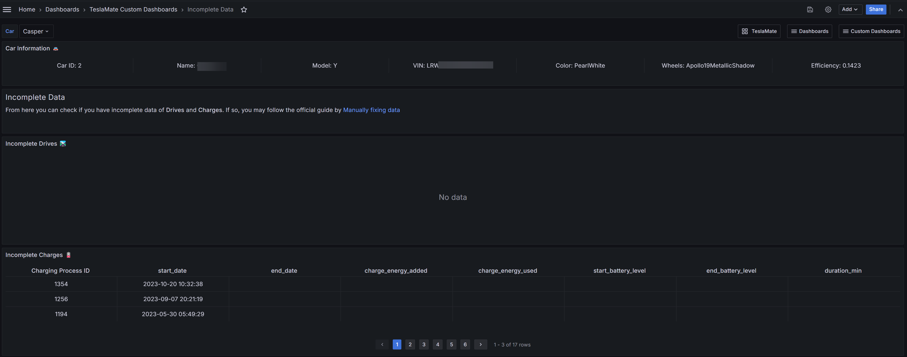

### [Range Degradation](./dashboards/RangeDegradation.json)

In this dashboard you may analize your mileage and the range degradation by a selected period.

So you may have an idea of how much of range is lost as well as if there were any failure in Teslamate logging your data.  

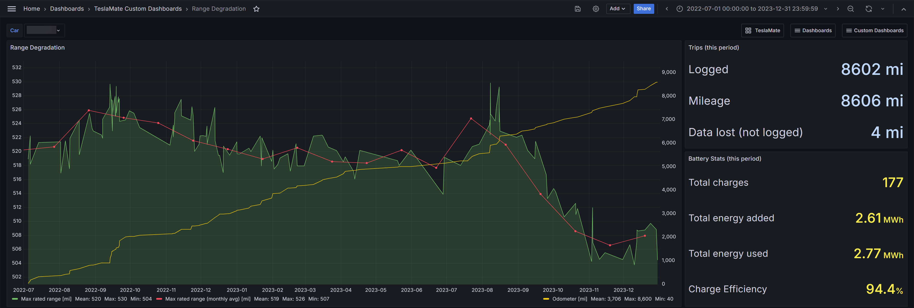

### [Mileage Stats](./dashboards/MileageStats.json)

With this dashboard you may analize your mileage and number of drives by year, month, week or day.

The dashboard shows a table with the selected period, time driven, distance, number of drives and efficiency then a bar chart to have a better look for comparison.  

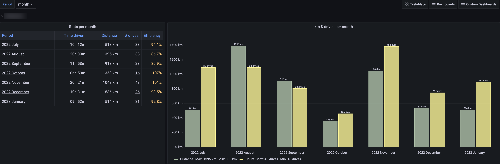

### [Speed Rates](./dashboards/SpeedRates.json)

In this dashboard you can browse the speed rates by segments, based on terrain type: Flat, Uphill or Downhill. This way you can see the average consumtion by speed and its average distance.
Likewise, you can see the Top speeds you reached and how long it lasted.

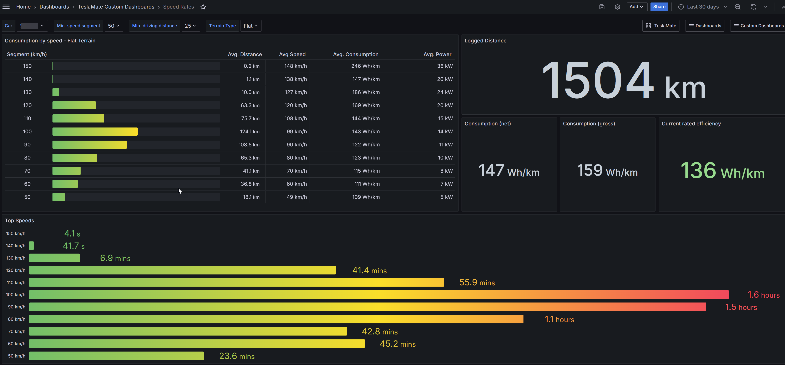

### [Speed & Temperature](./dashboards/SpeedTemperature.json)

In this dashboard you can browse and analyse the car consumption by temperature in short and long stretches. This way you can see the average consumption depending on the temperature to better understand the efficiency of the car in cold or hot climates.

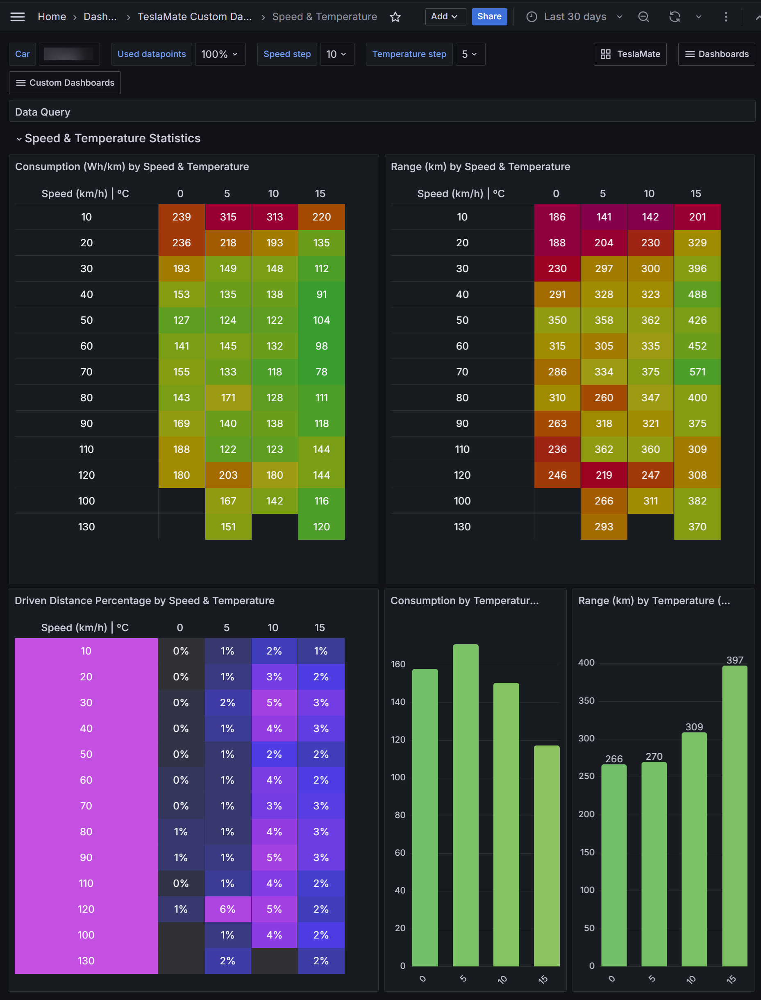

### [Tracking Drives](./dashboards/TrackingDrives.json)

This dashboard is meant to analize a drive based on a date you select, then you can pass the pointer over the lines in graph
to see data details and a blue point in the map tranking the route. With this option you can analized a specific point location in the map,
to see the speed, power, SOC, elevation and if battery heater was on.

Be aware that the drive you select in the dropdown list from the top could be outside the time range of the Timeline graph,
if its the case you have to click on the "Zoom to data" button on the graph in order to update it.

Tip: On Grafana you can press "h" to get a keyboard shortcuts if you want to change the current Zoom out time range or use the mouse to select/change the time range.


## Contributing

The following dashboards, queries and design are the result of many tests and hours of work.
Feel free to take them for your own personal use.

Contributions are what make the open source community such an amazing place to learn, inspire, and create. Any contributions you make are greatly appreciated.

If you are able to contibute or improve this project, please fork the repository and create a pull request. I'll really apreciate any enhancement or suggestion. Don't forget to give the project a star! Thanks again!

### Steps to create a pull request

1. Fork the Project
2. Change to the "develop" Branch (`git checkout develop`)
3. Create your Feature Branch (`git checkout -b feature/NewFeature`)
4. Commit your Changes (`git commit -m 'Add some NewFeature'`)
5. Push to the Branch (`git push origin feature/NewFeature`)
6. Open a Pull Request

Do not take the dashboards much less upload or merge them to other repositories as if the original idea were yours, nor do you share it on social media without mentioning the author. Please, **respect the ingenuity and work of others**. Enjoy!

## Donations

|     |     |
| --- | --- |
| If you like my work and want to support me, buying me a coffee would be greatly appreciated! Your support helps me to keep creating and improving these dashboards. Thank you! | [](https://www.paypal.com/donate/?business=MAWY99TACEXSU&no_recurring=0&currency_code=EUR) |
| Other way to support me is to use [my referral link](https://ts.la/juancarlos32618) to purchase a Tesla product and get Credits you can redeem for exclusive awards like Supercharging miles, merchandise, and accessories. | [](https://ts.la/juancarlos32618) |
|     |     |

## Credits

- Author: [Juan Carlos Heredia](https://infoinnova.net/contacto/)
- Based on/forked from [Adrian Kumpf](https://github.com/adriankumpf/teslamate) original code, with improvement of custom Grafana Dashboards (see [contributions history](https://github.com/jheredianet/Teslamate-CustomGrafanaDashboards/graphs/contributors)).

## License

Licensed under the [MIT license][license-url].

<!-- MARKDOWN LINKS & IMAGES -->
<!-- https://www.markdownguide.org/basic-syntax/#reference-style-links -->
[contributors-shield]: https://img.shields.io/github/contributors/jheredianet/Teslamate-CustomGrafanaDashboards.svg?style=for-the-badge
[contributors-url]: https://github.com/jheredianet/Teslamate-CustomGrafanaDashboards/graphs/contributors
[forks-shield]: https://img.shields.io/github/forks/jheredianet/Teslamate-CustomGrafanaDashboards.svg?style=for-the-badge
[forks-url]: https://github.com/jheredianet/Teslamate-CustomGrafanaDashboards/network/members
[stars-shield]: https://img.shields.io/github/stars/jheredianet/Teslamate-CustomGrafanaDashboards.svg?style=for-the-badge
[stars-url]: https://github.com/jheredianet/Teslamate-CustomGrafanaDashboards/stargazers
[issues-shield]: https://img.shields.io/github/issues/jheredianet/Teslamate-CustomGrafanaDashboards.svg?style=for-the-badge
[issues-url]: https://github.com/jheredianet/Teslamate-CustomGrafanaDashboards/issues
[discussions-shield]: https://img.shields.io/github/discussions/jheredianet/Teslamate-CustomGrafanaDashboards.svg?style=for-the-badge
[discussions-url]: https://github.com/jheredianet/Teslamate-CustomGrafanaDashboards/discussions
[license-shield]: https://img.shields.io/github/license/jheredianet/Teslamate-CustomGrafanaDashboards.svg?style=for-the-badge
[license-url]: ./LICENSE
